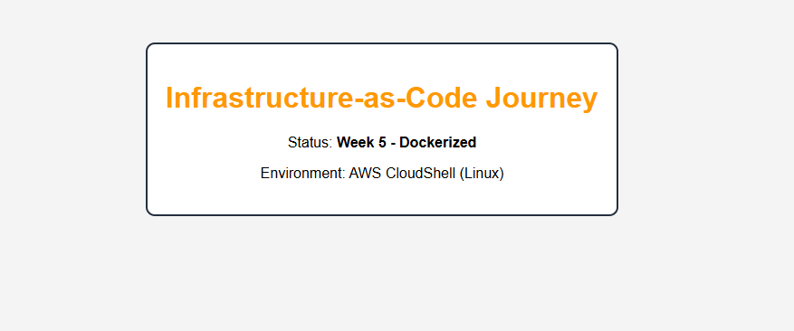

# 🚀 Infrastructure-as-Code Journey (SRE Roadmap)

[](https://www.terraform.io/)
[](https://aws.amazon.com/)
[](LICENSE)

This repository documents my journey and technical progression in Site Reliability Engineering. It contains production-grade Terraform configurations, architectural patterns, and automation workflows.

## 🏗️ Architecture: The Resilient Web Cluster
The current evolution of this infrastructure is a **Multi-AZ, Zero-Ingress** web cluster. It is designed to be managed entirely without SSH keys or public-facing management ports.

The last state of this infrastructure was a **Multi-AZ, Self-Healing, and Secret-Aware** web cluster designed to survive data center failures and follow Zero-Trust security principles.


### **Core Capabilities:**
- **Zero-Ingress Management:** Port 22 (SSH) is completely closed. Access is managed via **AWS Systems Manager (SSM) Session Manager**.
- **Security Group Chaining:** Web servers only accept traffic on Port 80 if it originates from the Load Balancer's Security Group.
- **Secrets Injection:** API keys and environment configs are fetched dynamically from **AWS Secrets Manager** at runtime.
- **Self-Healing:** Managed via Auto Scaling Groups (ASG) across multiple Availability Zones.

---

## 🏆 Featured Projects

### **Project 1: Multi-Environment Portfolio Engine**
A production-grade framework that deploys isolated static websites across multiple environments using a single codebase.
* **Core Feature:** Environment isolation using **Terraform Workspaces** (`dev` vs `prod`).
* **Backend:** Remote state managed via S3 with DynamoDB state locking.
* **Infrastructure:** Custom S3 Website modules with automated policy injection.
* **Results:**
    * [Dev URL](http://abhijeet-portfolio-dev-2025.s3-website-us-east-1.amazonaws.com)
    * [Prod URL](http://abhijeet-portfolio-prod-2025.s3-website-us-east-1.amazonaws.com)

### **Project 2: The Security-Hardened Fleet (Week 4 Capstone)**
The culmination of the networking and security phases, moving from public-facing instances to a private, secret-aware infrastructure.
* **Secrets Management:** 100% removal of hardcoded credentials using **AWS Secrets Manager**.
* **Identity & Access:** Implemented IAM Roles and Policies to grant "Least Privilege" access to cloud resources.
* **Network Isolation:** Deployment of servers in private subnets, accessible only through a hardened Load Balancer.

---

## 📝 Progression Log

### Week 5: Containerization & Cloud Deployment

#### Overview
This project demonstrates a full CI/CD lifecycle: packaging a custom web application into a Docker container, hosting it in a private cloud registry, and deploying it to an AWS EC2 instance.

## Technical Stack
* **Web Server:** Nginx (Alpine-based)
* **Containerization:** Docker
* **Registry:** Amazon Elastic Container Registry (ECR)
* **Infrastructure:** AWS EC2 (t3.micro)
* **Identity Management:** IAM Instance Profiles & Roles

#### Architecture
1. **Build:** A custom Docker image was built locally using a multi-stage-ready Dockerfile.
2. **Push:** The image was tagged and pushed to a private AWS ECR repository.
3. **Provision:** An EC2 instance was launched with a specific IAM Role to allow ECR access.
4. **Deploy:** A User Data script automated the Docker installation and pulled the image on boot.

#### How to Run Locally
\`\`\`bash
docker build -t sre-welcome:v1 .
docker run -p 8080:80 sre-welcome:v1
\`\`\`

#### Live Deployment Proof


### **Week 4.2: Security & Hardening (Current)**
- **SSM Session Manager:** Removed the need for SSH keys and closed Port 22 across the fleet.
- **Secret Management:** Integrated AWS Secrets Manager for secure runtime variable injection.
- **IAM Refactoring:** Built a "Least Privilege" IAM Role for EC2 with specific policies for SSM and Secrets.
- **Advanced Networking:** Implemented Security Group Chaining to isolate private instances.


### **Week 4: Security & Secret Management**
**Focus:** "Infrastructure Hardening"
- **IAM Instance Profiles:** Eliminated programmatic keys by assigning digital identities to EC2.
- **AWS Secrets Manager:** Implemented secure injection of API Keys and environment variables.
- **Bootstrap Automation:** Enhanced `user_data` to fetch secrets at runtime using the AWS CLI and `jq`.
- **Modular Refactoring:** Organized the repo by moving historical logic to `/archives` to maintain state continuity.

### **Week 3: Observability & Resilience**
**Focus:** "Making Infrastructure Visible"
- **Load Balancing:** Implemented an ALB to distribute traffic and handle SSL termination points.
- **Health Checks:** Configured aggressive thresholds to ensure zero-downtime during fleet rotations.
- **CloudWatch Dashboards:** Built a centralized performance view for monitoring fleet-wide CPU utilization.
- **SNS Alerts:** Automated email notifications for infrastructure anomalies.

### **Week 2: Networking & Connectivity**
**Focus:** "The Cloud Skeleton"
- **VPC Design:** Built a custom VPC with dynamic subnetting across multiple AZs.
- **Cost Engineering:** Replaced expensive NAT Gateways with a custom **NAT Instance** (Amazon Linux 2023) to stay within the AWS Free Tier.
- **Security Group Chaining:** Implemented "Least Privilege" where web servers only accept traffic from the ALB.

### **Week 1: Foundations & State**
**Focus:** "The IaC Lifecycle"
- **State Management:** Migrated local state to S3 with DynamoDB locking.
- **Modules:** Refactored S3 logic into a reusable child module.
- **Workspaces:** Mastered environment switching for `dev` and `prod` deployments.

---

## 📁 Repository Structure
```text
Infrastructure-as-Code-journey/
├── main.tf                  # Root: Module orchestration
├── variables.tf             # Root: Global inputs
├── outputs.tf               # Root: High-level endpoints
├── terraform.tfvars         # Root: Environment values
├── modules/
│   ├── networking/          # VPC, ALB, ASG, IAM, & Secrets
│   └── monitoring/          # CloudWatch Alarms & SNS
└── archives/                # Historical milestones (Week 1-3)
```

## ⚙️ How to Deploy
**Initialize**: ```bash terraform init -reconfigure

**Format & Validate**: ```bash terraform fmt -recursive && terraform validate

**Plan**: ```bash terraform plan -out=tfplan

**Deploy**: ```bash terraform apply "tfplan"

**Connect**: Use aws ssm start-session --target <instance-id> or the AWS Console (No SSH key needed).

**Cleanup**: ```bash terraform destroy -auto-approve


## 🧠 SRE Skills Demonstrated
**Infrastructure as Code**: Advanced modularization and variable inheritance patterns.

**Security**: Zero-Ingress architecture, Secrets management, IAM Least Privilege, and Security Group hardening (previous commit).

**Cost Optimization**: Engineering around cloud provider costs (NAT Instance vs NAT Gateway).

**Automation**: Bash bootstrapping for application-level configuration and runtime security.
